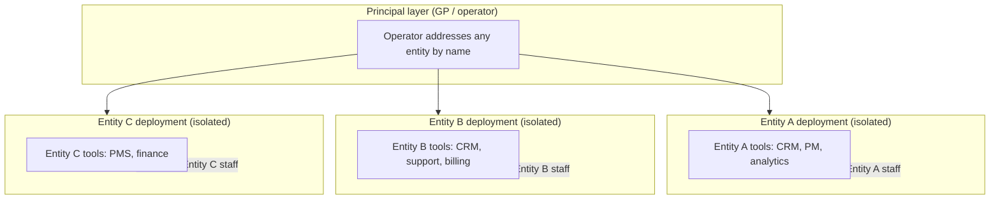
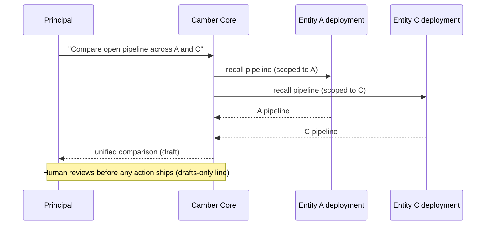
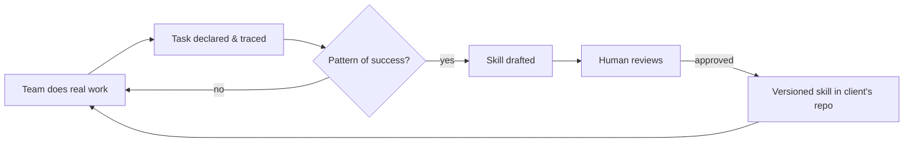

# DESIGN — the full framework

Goal: turn a chosen opportunity into a concrete Camber Core deployment design, deep and
visual. This is the main event. Use Mermaid diagrams. Stay at the public altitude.

## What every design includes

1. **Architecture diagram** — entity-isolated deployments, principal access, and where
   their named tools connect.
2. **Data-flow / sequence diagram** — the key workflow the solution improves.
3. **Narrative** — departments touched, manual work removed, decisions accelerated.
4. **Skills capture** — what reusable procedures this generates over time.
5. **Continuous fit** — how the managed service keeps it current.

## Mermaid pattern — entity isolation + principal access

## Mermaid pattern — cross-entity workflow (sequence)

## Mermaid pattern — skills capture loop

## Roadmap shape

Sequence the work so value lands early and compounds:

1. **First deployment** — stand up the highest-impact entity; wire its core tools; prove
   the cross-entity review or the first captured skill.
2. **Expand across entities** — replicate the deployment pattern entity by entity;
   principals gain cross-entity reach.
3. **Skills accrue** — recurring work becomes a growing library; per-task cost falls.
4. **Continuous fit** — the managed service keeps each deployment current as the
   business changes.

Present the roadmap as a short table (phase, what ships, what it unlocks), then ask in
numbered options whether the sequence matches their priorities.

## Altitude rule (re-read `../SKILL.md` Guardrails)

Design with the public vocabulary: "managed AI infrastructure, dedicated operator,
internal agent fleet under human review, drafts-only line, platform independence."

Never depict internal delivery mechanics: no GitHub control-plane, no automatic
issue-filing internals, no cross-client pattern-detection machinery, no
"Service-as-Software," no "fully automated." If a diagram would require showing those,
abstract them to "Inform Growth managed service (human-in-the-loop)."
